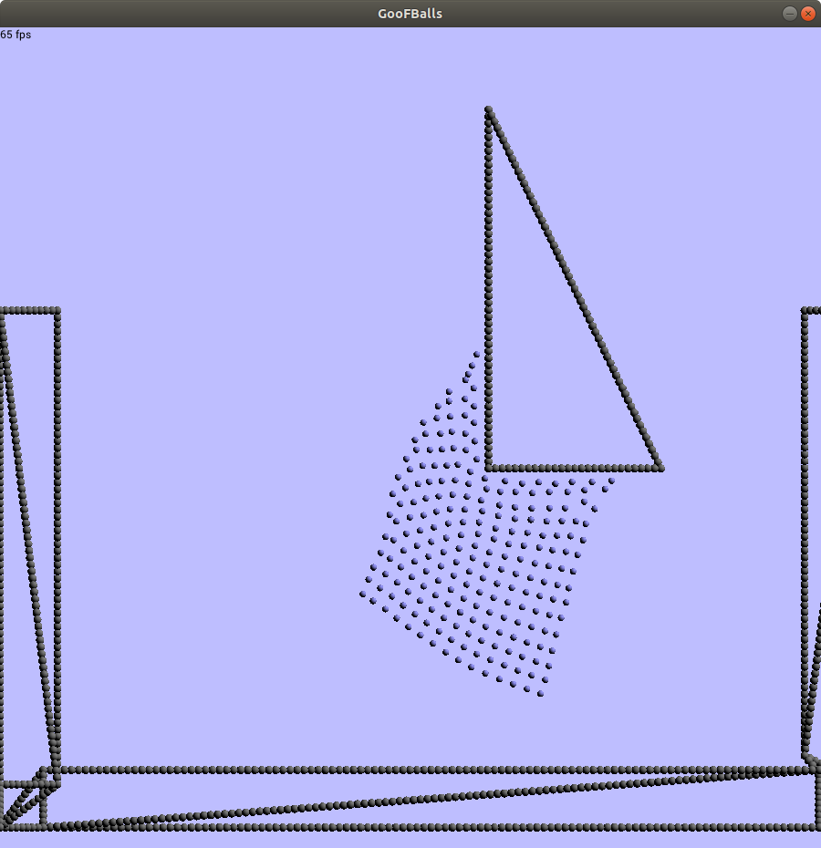
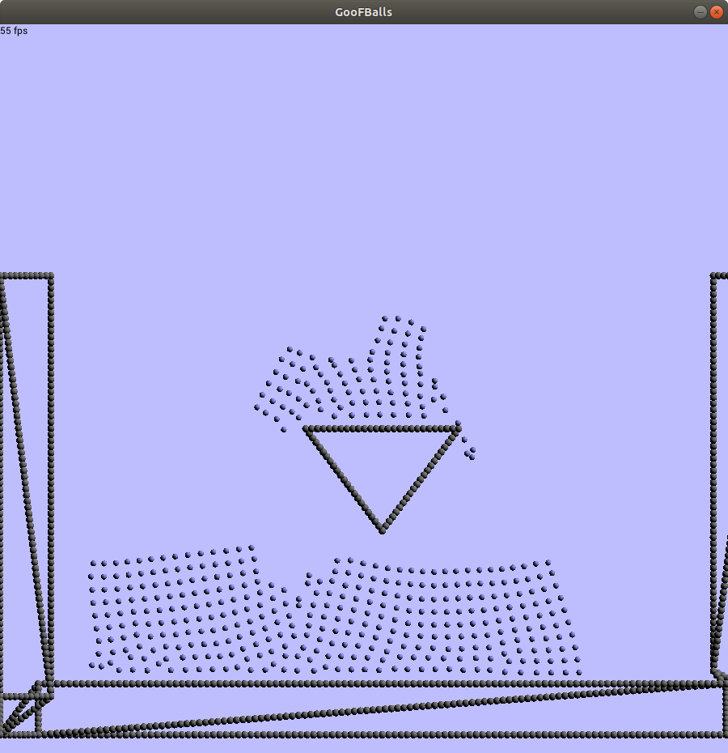
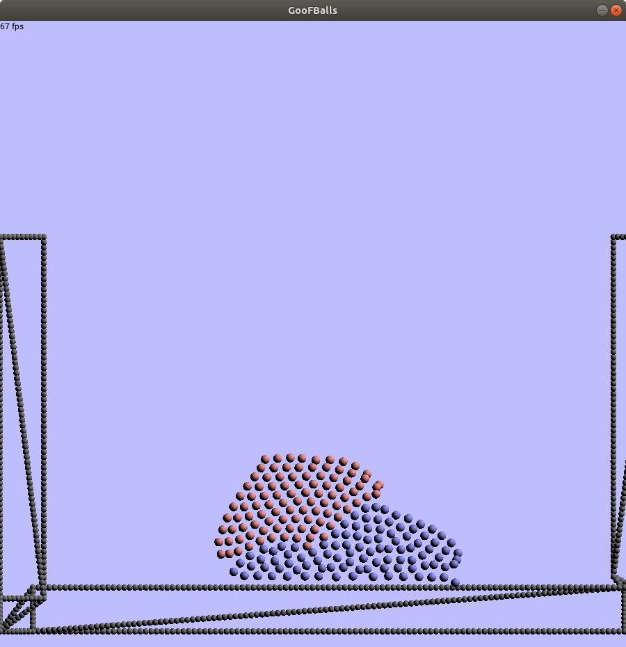

# GooBalls

Semester project in Physically-Based Simulations 2018.

## Code base

- `src`: This folder should hold all C++ production code. It is split in a library part `lib` and an applicaiton part `GooBallsApp`. 
	- `lib` holds modular components, they should be well designed and reusable. 
	- `GoofBallApp` holds "messy" code: Things we want to hard-code, these are the application specific parts that aren't necessarily reusable. 

	If your code can be formulated in a "library-way", please make it nice and clean and put it in `lib`. But there's no need to put all command line arguments in a modular framework, just hard-code them in a configuration `.cpp` file within the app directory and we're good.

- `README.md`: Everything you need to know to get started in this repository.

## Submodules

If you can't find nanogui or one of its dependencies, try:

```bash
$ git submodule update --init --recursive
```

Or 
```bash
$ git submodule update --recursive
```


## Build instructions

As for each cmake project, create a `build` folder (preferably in the project root, otherwise the default paths won't work) and run `cmake ..`. Then call `make` and wait until it compiled.

### Building tools

Ubuntu:

`sudo apt install build-essentials git cmake`

### Dependencies

Boost for unit testing and logging.

Box2D as rigid body solver.

Eigen as linear algebra library.

Ubuntu packages:

`sudo apt install libbox2d-dev libboost-filesystem-dev libboost-program-options-dev libboost-log-dev libboost-test-dev libjsoncpp-dev xorg-dev libgl1-mesa-dev libeigen3-dev`

Needed boost version: at least 1.65

### Run the application

After building, you should find the executable in the build folder at `src/GooBallsApp/gooBalls`.

You need to run it from the build folder with `./src/GooBallsApp/gooBalls`. Otherwise it won't be able to find needed files (shaders, example scenes etc.).

By default, the `falling_box.json` scene will be loaded (a bunch of boxes falling onto a block of visco elastic material). 

You can find more example scenes at `examples/scenes`.

To load another scene, please call the executable with the scene path as command line argument. 

Example:

```bash
./GooBallsApp/gooBalls ../../examples/scenes/split_connections.json
```

#### Controlling the simulation

Following controlls are available:

- `SPACE`: Pause and continue the simulation execution.

- `Right arrow`: Compute one frame and then stop. (Note: this is to compute one frame, one frame can cause multiple smaller simulation time steps.)

- `Shift` + `Right arrow`: Compute exactly one simulation step (one `dt`).

- `Up arrow`: Accelerate the simulation speed

- `Down arrow`: Slow the simulation down. Note: The simulation timestep is not changed, so the lowest speed you can choose, is one simulation step at a time. This means hitting the down arrow will slow the simulation down only to a minimum speed.

- `W`/`A`/`S`/`D`: Change the fluid's velocity. Note: The fluid can get stuck, if the adhesion to a wall is to strong. Note: The integration with nanogui isn't optimal, causing notable lag on occasion.

- You can find additional command line controlls via the `--help` flag of the application.

## Some outlines to find your way in the code base

In its core, the visco-elastic material is a SSPH (as described by Müller et al.: Particle-based fluid simulation for interactive applications, 2003) and the particle velocity correction as introduced by Takahashi et al. (Volume Preserving Viscoelastic Fluids with Large Deformations Using Position-based Velocity Corrections, 2016). The rigid-fluid coupling is performed as described in Versatile Rigid-Fluid Coupling for Incompressible SPH (Akinci et al., 2012).

The code is split in multiple parts to be flexible and allow experimentation. Each kernel is modeled by a class. Most of the SPH code can be found in the abstract SPH class, as many parts are generic and can be reused. SSPH mostly picks those fragments (like computation of pressure and viscosity force) and adds them together. The ViscoElastic class then add the velocitiy correction after the base fluid solver did its job.

Range queries to get the neighborhood of a particle is computed onced for each iteration step and stored. The responsible class must inherit from `Neighborhood` (spatial module).

Most of the code can be found in the `physic` subfolder within `src/lib`. Another important folder is `rendering` which hold files to interact with openGL. 

## Examples

To create a scene, the application needs to read a json file (for the options and exact structure, please check the `SceneLoader` class, there's no official documentation yet. 

Multiple example scenes are availabl in the folder `examples/scenes` that present different aspects of the visco elastic material. 

Different "features" are supported. For example, the visco elastic material is able to stick to walls:



Or it can split and merge:




# Open issues

- `tunnelling`: If particles travel at high speed, they can occasionally pass through walls as the pressure forces between fluid and boundary particles aren't sufficient to stop them. There are at least two main ways to solve this issue: 

	- One could use an incompressible fluid solver that guarantees the particle's density to remain close to the rest density. This approach can break the real-time property of the algorithm, as many approaches use a convergence criterion. There are rarely guarantees on how long it takes to converge on a solution. This is not acceptable for real-time interaction.

	- Position correction: A solution that tries to fix tunnelling after it happened. The idea is, to detect particles that lie within a triangle and then to move them backwards until they are outside the triangle again. This approach can only be used for scene geometry with area. It is not clear, how this approach would work for lonely lines and points.
